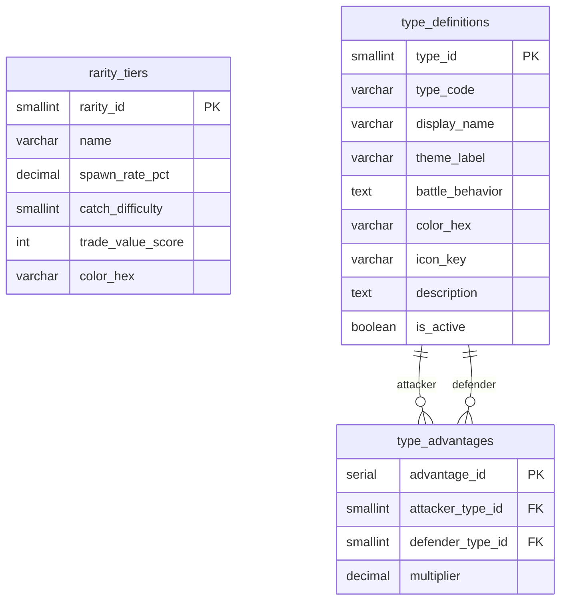
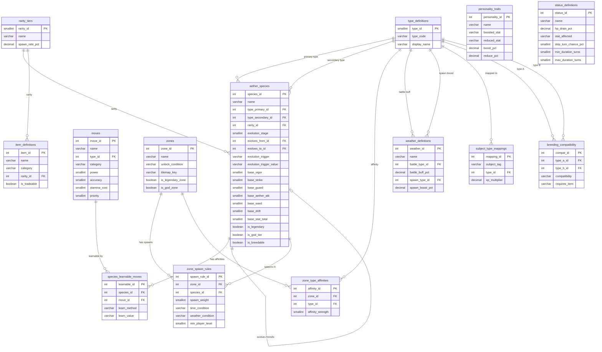
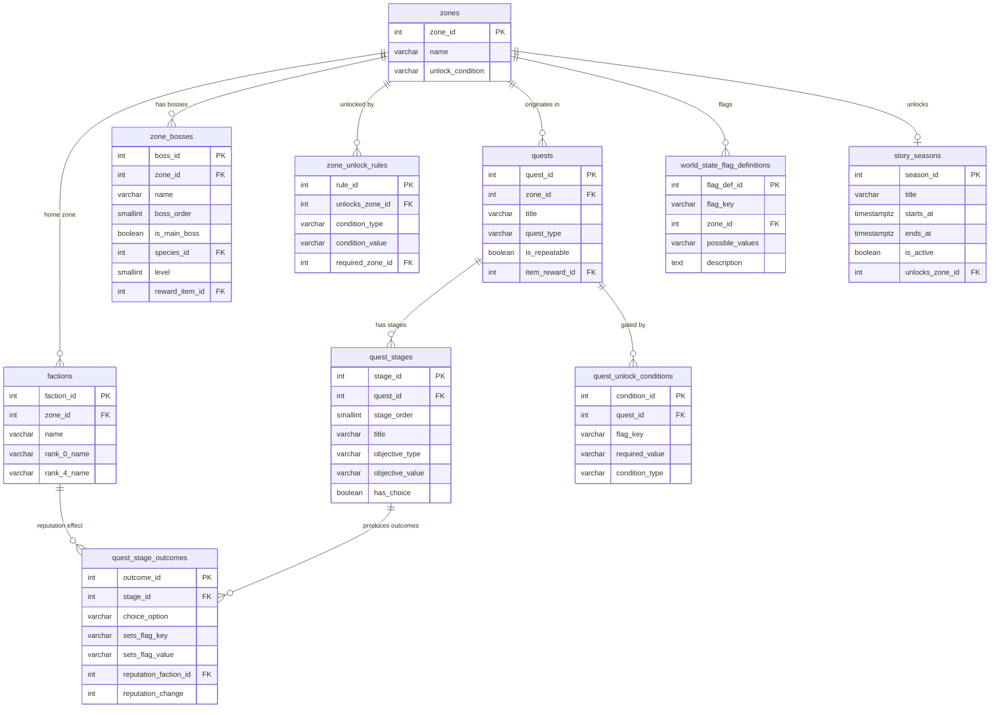
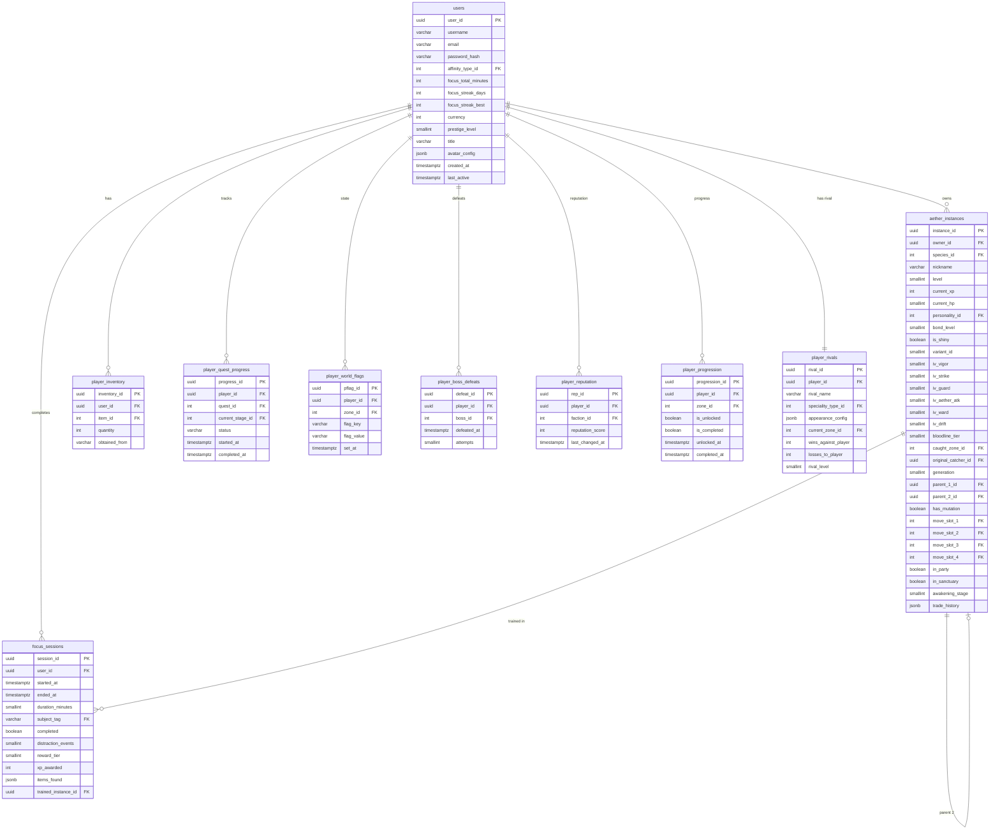
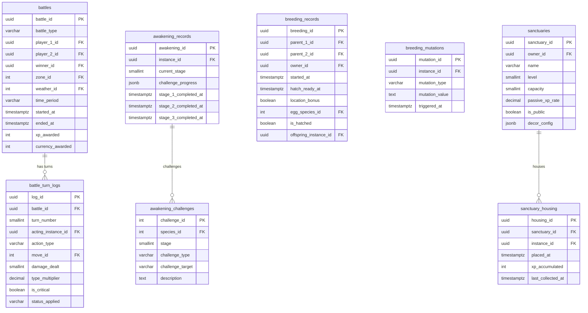
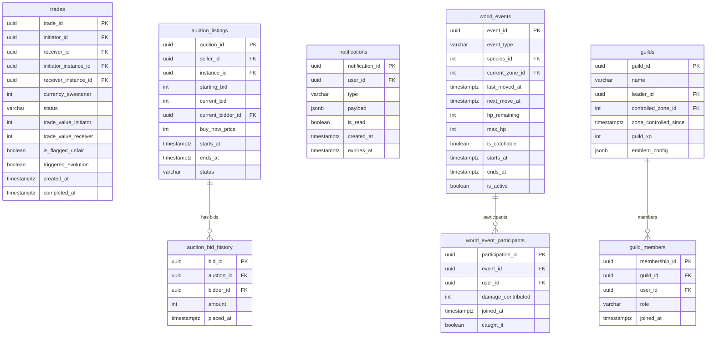

# 🗄️ Aetheria — Database Architecture

> **Stack:** PostgreSQL 16 · Redis 7 · Flyway migrations  
> **Pattern:** Data-driven design — game rules live in table rows, not in code  
> **Theme rule:** Types are fully configurable data rows. Switching the type theme = update `type_definitions` rows only. Zero schema changes.

---

## 📋 Table of Contents

- [Core Design Principles](#-core-design-principles)
- [Phase Overview](#-phase-overview)
- [Phase 0 — Foundation](#phase-0--foundation-tables)
- [Phase 1 — Static Game Config](#phase-1--static-game-config)
- [Phase 1 — World & Story Systems](#phase-1--world--story-systems)
- [Phase 2 — Live Player Data](#phase-2--live-player-data)
- [Phase 3 — Battle, Breeding & Sanctuary](#phase-3--battle-breeding--sanctuary)
- [Phase 4 — Economy, Social & World Events](#phase-4--economy-social--world-events)
- [Redis — What Lives Outside Postgres](#-redis--what-lives-outside-postgres)
- [Indexes](#-indexes)
- [Full Dependency Tree](#-full-dependency-tree)

---

## 🧠 Core Design Principles

| Principle | What It Means | Example |
|-----------|---------------|---------|
| **Data-driven** | Game rules live in rows, not code | Type advantages, spawn rules, quest outcomes |
| **Template / Instance** | Config data defines what exists. Live data tracks what happened. | `aether_species` vs `aether_instances` |
| **Dependency order** | Build tables with no FK first. Work outward. | `rarity_tiers` → `aether_species` → `aether_instances` |
| **World flags pattern** | Quests communicate through shared state, never directly | `player_world_flags` is the only inter-quest channel |
| **Server timestamps** | Never trust client-provided times on reward-affecting actions | `focus_sessions.started_at`, `ended_at` |
| **UUID primary keys** | Cannot enumerate IDs — better security than sequential INT | `users`, `aether_instances`, all live data |
| **Denormalize carefully** | Duplicate a value only when the join is too expensive at scale | `focus_total_minutes` on `users` |
| **Redis for volatile data** | Fast-changing state does not belong in Postgres | Live battle state, weather, spawn cache |
| **Partition big tables** | Split by date before they grow unmanageable | `battle_turn_logs`, `focus_sessions` — monthly |
| **JSONB for flex config** | Use JSONB when a field's schema varies or changes often | `avatar_config`, `notification payload` |

---

## 📦 Phase Overview

```
Phase 0 — Foundation          rarity_tiers, type_definitions, type_advantages
Phase 1 — Static Config       species, moves, zones, weather, items, personalities
Phase 1 — Story Systems       quests, bosses, world flags, factions, rivals, seasons
Phase 2 — Live Player Data    users, aether instances, focus sessions, progression
Phase 3 — Battle & Breeding   battles, turn logs, breeding, sanctuary, awakening
Phase 4 — Economy & Social    trades, auctions, notifications, world events, guilds
```

---

## Phase 0 — Foundation Tables

> These have **zero dependencies**. Everything else references them. Built first.



### `type_definitions` — The Theme-Swappable Core
The most important architectural decision in the schema. The current type theme is **Fashion** (Noir, Soleil, Luxe...). If the theme changes to Emotions or Music — update these 10 rows only. `type_id` and `type_code` are **permanent and never change**. Every other table references types by `type_id` integer only, never by name.

| type_id | type_code | display_name | theme_label |
|---------|-----------|--------------|-------------|
| 1 | T01 | Noir | Gothic Dark Romance |
| 2 | T02 | Soleil | Cottagecore Nature |
| 3 | T03 | Luxe | Victorian Aristocrat |
| 4 | T04 | Rave | Cyberpunk Neon |
| 5 | T05 | Bloom | Kawaii Hyper-Cute |
| 6 | T06 | Grim | Dark Academia Occult |
| 7 | T07 | Wilde | Punk Anarchist |
| 8 | T08 | Aura | Ethereal Celestial |
| 9 | T09 | Ironclad | Steampunk Industrial |
| 10 | T10 | Vex | Clowncore Jester |

### `type_advantages` — The Battle Matchup Matrix
Stored as data rows. Battle engine query: `SELECT multiplier WHERE attacker_type_id = ? AND defender_type_id = ?`. Neutral matchups (1.00) are **not stored** — app defaults to 1.00 if no row found.

| Multiplier | Meaning |
|------------|---------|
| `2.00` | Strong against |
| `1.00` | Neutral (not stored) |
| `0.50` | Weak against |
| `4.00` | Double weakness (dual-type) |
| `0.25` | Double resistance |

---

## Phase 1 — Static Game Config

> Developer-defined rulebook. Changes rarely. All live data references these tables.



### Evolution Chain — Self-Referencing Pattern
`aether_species` references itself for the evolution chain. `evolves_from_id` and `evolves_to_id` both point back to the same table. On seed: insert all species with nulls first, then update the FK columns in a second pass to avoid constraint errors.

```
Cindril (001, stage 1)  →  Pyrath (002, stage 2)  →  Magnarex (003, stage 3)
evolves_to_id=002          evolves_to_id=003          evolves_to_id=null
evolves_from_id=null       evolves_from_id=001        evolves_from_id=002
```

### Stat Ranges by Evolution Stage
| Stage | Base Stat Total |
|-------|----------------|
| 1 (Base) | 200 – 270 |
| 2 (Mid) | 340 – 420 |
| 3 (Final) | 480 – 560 |
| Legendary | 580 – 640 |
| God Tier | 650 – 720 |

**Level-up formula:** `StatGain = (BaseStat × 0.02) + Random(1, 3)`

---

## Phase 1 — World & Story Systems

> The quest, progression, reputation, and story architecture.



### 🌍 How the Interdependent Quest System Works

Quests **never talk to each other directly**. They communicate only through world state flags.

```
EXAMPLE: The Stolen Artifact

Quest 1: "Catch the Thief"      → available from zone start
Quest 2: "The Stolen Relic"     → available from zone start  
Quest 3: "Gang's Errand"        → unlocks after talking to gang NPC
Quest 4: "The True Owner"       → HIDDEN — complex unlock conditions

Player catches thief (Quest 1, Stage 3, choice = "catch"):
  quest_stage_outcomes writes to player_world_flags:
    thief_caught          = true
    artifact_location     = player_inventory

  Server checks ALL active quests:
    Quest 1 → condition met → COMPLETE ✅
    Quest 2 → auto-advances ✅
    Quest 4 → unlock check fails (needs artifact_returned = true)

Player gives artifact to gang (Quest 3 completion):
    gang_has_artifact     = true
    Quest 3 → COMPLETE ✅
    Quest 4 → still locked

IF INSTEAD player returns artifact to true owner:
    artifact_returned     = true
    Quest 4 unlock conditions NOW met → Quest 4 APPEARS 🔓
```

### 🗺️ Zone Unlock — Focus-Driven Story Gates
Unique to Aetheria. A zone can require **both** defeating a boss AND completing real-world focus sessions.

```
zone_unlock_rules examples:

unlocks_zone_id=2 | condition_type="boss_defeated"   | condition_value="zone_1_main"
unlocks_zone_id=2 | condition_type="focus_sessions"  | condition_value="5"
unlocks_zone_id=2 | condition_type="streak_days"     | condition_value="3"

→ All three rows must be true simultaneously to unlock Zone 2
```

---

## Phase 2 — Live Player Data

> Created at runtime per player. Depends on all Phase 0 + 1 tables existing.



### 🎯 Anti-Cheat Rules for Focus Sessions
| Rule | Detail |
|------|--------|
| Server timestamps only | `started_at` and `ended_at` are server-assigned. Never trust client. |
| Max single session | 240 minutes — flag anything above |
| Daily cap | 600 minutes — rewards stop accruing above this |
| Distraction penalty | `distraction_events > 5` → `reward_tier` drops one level |
| IP overlap check | Overlapping sessions from same IP = auto-reject |
| Validation on end | Server checks `(ended_at - started_at)` against claimed duration |

### 🎮 Reward Tiers
| Tier | Duration | XP Range | Max Item Rarity |
|------|----------|----------|-----------------|
| 1 Bronze | 15–24 min | 50–100 | Common |
| 2 Silver | 25–49 min | 100–250 | Rare |
| 3 Gold | 50–89 min | 250–500 | Very Rare |
| 4 Platinum | 90–119 min | 500–800 | Epic |
| 5 Diamond | 120+ min | 800–1200 | Ancient |

---

## Phase 3 — Battle, Breeding & Sanctuary



### ⚔️ Damage Formula
```
Damage = ((2 × Level / 5 + 2) × Power × Atk/Def) / 50 + 2
         × TypeMultiplier      ← from type_advantages table
         × RandomFactor         ← 0.85 – 1.00
         × PersonalityModifier  ← from personality_traits table
         × WeatherModifier      ← from weather_definitions table
         × BondModifier         ← 0.95 – 1.10 based on bond_level
```

> ⚠️ **Battle turn logs** should be **partitioned by month** from day one. This table hits tens of millions of rows quickly. Do not retrofit this later.

---

## Phase 4 — Economy, Social & World Events



### 🌍 World Event — Shared Boss Mechanic
A God-tier Aether appears, moves between zones every 30 minutes, and has a **shared HP pool** all players chip away at.

```
World Event lifecycle:
  1. Event starts → hp_remaining = max_hp, is_catchable = false
  2. Players deal damage → HP tracked in Redis (not Postgres per-hit)
  3. Every 30 min → current_zone_id updates, creature moves
  4. HP drops below 20% → is_catchable = true
  5. First player to catch it → world_event_participants.caught_it = true
  6. Event ends → uncaught = despawn, archive record
```

---

## 🔴 Redis — What Lives Outside Postgres

> Fast-changing, ephemeral, or real-time data lives in Redis — not Postgres.

| Key Pattern | What It Stores | TTL |
|-------------|---------------|-----|
| `session:active:{user_id}` | Live focus session state | Session duration |
| `streak:{user_id}` | Current streak + last session date | 28 hours |
| `weather:{zone_id}` | Current weather state | Until next rotation |
| `time_period:current` | Current global time period | Until next period |
| `world_event:active` | Live event HP, participant count | Event duration |
| `battle:{battle_id}` | Full live battle state (HP, status, turn) | Until battle ends |
| `leaderboard:focus:weekly` | Sorted set: top focus minutes | 7 days |
| `leaderboard:focus:alltime` | Sorted set: lifetime focus | No expiry |
| `online_users` | Set of active user_ids | Rolling 5-min |
| `spawn_cache:{zone_id}:{weather}:{time}` | Computed spawn weights | 1 hour |
| `type_advantages:cache` | Full advantage matrix | 24 hours |
| `rival:{player_id}:location` | Player's rival current zone | 1 hour |

---

## 📈 Indexes

| Table | Index | Reason |
|-------|-------|--------|
| `aether_instances` | `(owner_id, species_id, in_party)` | Party screen — most frequent query |
| `focus_sessions` | `(user_id, started_at, completed)` | Session history + streak calc |
| `zone_spawn_rules` | `(zone_id, weather_condition, time_condition)` | Spawn engine — every encounter |
| `type_advantages` | `(attacker_type_id, defender_type_id) UNIQUE` | Battle damage — every turn |
| `trades` | `(initiator_id, status)`, `(receiver_id, status)` | Active trades inbox |
| `auction_listings` | `(status, ends_at)` | Expiry sweep + marketplace browse |
| `notifications` | `(user_id, is_read, created_at)` | Unread badge count |
| `battle_turn_logs` | `(battle_id)` + PARTITION BY month | Replay query + size management |
| `player_world_flags` | `(player_id, zone_id, flag_key)` | Quest condition checks |
| `player_quest_progress` | `(player_id, status)` | Quest log screen |
| `player_reputation` | `(player_id, faction_id)` | NPC interaction rep checks |
| `world_event_participants` | `(event_id, user_id)` | Leaderboard + duplicate prevention |

---

## 🌳 Full Dependency Tree

> A table cannot be created before all tables it references exist.

```
Phase 0 — No dependencies
├── rarity_tiers
├── type_definitions
└── type_advantages                ← type_definitions

Phase 1 — Static Config
├── personality_traits
├── status_definitions
├── streak_milestones
├── zones
├── factions                       ← zones
├── weather_definitions            ← type_definitions
├── item_definitions               ← rarity_tiers
├── aether_species                 ← rarity_tiers, type_definitions (self-ref)
├── moves                          ← type_definitions
├── species_learnable_moves        ← aether_species, moves
├── zone_spawn_rules               ← zones, aether_species
├── zone_type_affinities           ← zones, type_definitions
├── subject_type_mappings          ← type_definitions
└── breeding_compatibility         ← type_definitions

Phase 1 — Story Config
├── story_seasons                  ← zones
├── zone_bosses                    ← zones, aether_species, item_definitions
├── zone_unlock_rules              ← zones
├── quests                         ← zones, item_definitions
├── quest_stages                   ← quests
├── quest_stage_outcomes           ← quest_stages, factions
├── quest_unlock_conditions        ← quests
└── world_state_flag_definitions   ← zones

Phase 2 — Live Player Data
├── users
├── player_rivals                  ← users, type_definitions
├── sanctuaries                    ← users
├── aether_instances               ← users, aether_species (self-ref)
├── sanctuary_housing              ← sanctuaries, aether_instances
├── focus_sessions                 ← users, aether_instances
├── player_inventory               ← users, item_definitions
├── player_quest_progress          ← users, quests, quest_stages
├── player_world_flags             ← users, zones
├── player_boss_defeats            ← users, zone_bosses
├── player_reputation              ← users, factions
└── player_progression             ← users, zones

Phase 3 — Battle, Breeding & Sanctuary
├── battles                        ← users, zones, weather_definitions
├── battle_turn_logs               ← battles, aether_instances, moves  [PARTITION BY MONTH]
├── awakening_challenges           ← aether_species
├── awakening_records              ← aether_instances
├── breeding_records               ← aether_instances, users, aether_species
└── breeding_mutations             ← aether_instances

Phase 4 — Economy, Social & World Events
├── trades                         ← users, aether_instances
├── auction_listings               ← users, aether_instances
├── auction_bid_history            ← auction_listings, users
├── notifications                  ← users
├── world_events                   ← aether_species, zones
├── world_event_participants       ← world_events, users
├── guilds                         ← users, zones
└── guild_members                  ← guilds, users
```

---

## 🗂️ Migration Files

Migrations live in `packages/db/migrations/` using Flyway naming convention:

```
V001__phase0_foundation.sql          ← type system, rarity tiers ✅
V002__phase1_static_config.sql       ← species, moves, zones, weather, items
V003__phase1_story_systems.sql       ← quests, bosses, factions, seasons
V004__phase2_players.sql             ← users, instances, focus sessions
V005__phase3_battle_breeding.sql     ← battles, breeding, sanctuary
V006__phase4_economy_social.sql      ← trades, auctions, world events, guilds
```

> **Rule:** Never edit a migration file after it has been applied to any environment. Always create a new `V00X__` file for changes.

---

*Aetheria Database Architecture · Internal Development Reference*
